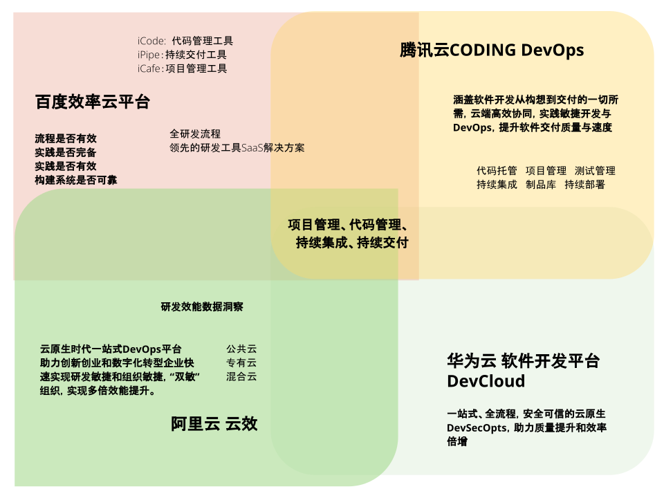
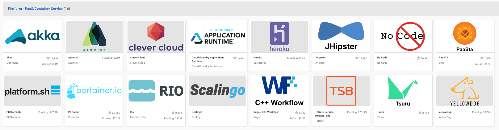

# 定位

云基础设施越来越完备，生长在上面的服务也自然越来越丰富。
我们可以从服务的角度来看看大家分别从什么角度来应用云计算的。

## 先看国内研发效能云平台：

研发效能的前生是研发效率，早在2014年，百度就成立了研发效率部。
那时候该部门更多的职责就是规范研发部生产流程，以衡量和提高研发效率为目的。
也在同一年，DORA发布了DevOps行业报告。除了2020年不知道什么原因断更外，基本上是每年必更，一直到现在。

在最新的2021年报告中，和研发效能相关的描述有如下片段：

“To meet the demands of an ever-changing industry, organizations must deliver and operate software quickly and reliably. The faster your teams can make changes to your software, the sooner you can deliver value to your customers, run experiments, and receive valuable feedback.  ” - Accelerate State of DevOps 2021

说的是，**企业如果想要赢得瞬息万变的市场，需要具备快速并可靠的交付和运营软件的能力**。

通过上图，我们可以看出，国内几大云厂商，基于云计算，对研发效能的理解：

共识点：

* 全流程/一站式，也就是我们所说的端到端
* 提供的服务也是类似的，项目管理、代码管理、持续集成、持续交付，家家都有。从工具的角度来说，我认为二十几年来，敏捷活动算是成功的，毕竟大家现在都在用敏捷理念相关的这些工具。

个性点：
* 百度效率云强调自己是SaaS解决方案，就像AWS，提供一揽子工具，供用户自行选择使用。
* 腾讯云CODING DevOps强调的是云端高效协同，主要在于提升软件交付质量和速度。
* 阿里云云效则强调“双敏” - 研发敏捷和组织敏捷，以及关键词云原生、数字化转型等。
* 华为云软件开发平台DevCloud，则重点强调安全可信，提供的是云原生DevSecOpts

这样看来，这几家都完全买单研发效能的理念，主动进入到了研发效能的大舞台。
经过持续投入，孵化并以云的形式开放了这些服务。
基于自身的文化和特长，和对研发效能的不同理解，强化了自己的个性和擅长点。

可以看出解决的问题还是为了提高效率，提升体验。
变化的是从线下到了线上，从企业内自己用，到发布到线上，所有人都可以用。

## 再看国际云原生组织CNCF(Cloud Native Computing Foundation)：

来看一张简略版[全家福](https://l.cncf.io)：

可谓是琳琅满目，数不胜数。
仅从这就能看出云计算所创造的巨大市场，让用户在云上就能挑选到所有你需要的产品和服务。
就像我们的线上商城一样。

结合CNCF这张局势图，很快我们就能发现，目前只要能想到的，基本上都有人在做了，而且还很多。
大的领域都分好了，那就找个细分的吧。
想让自己的开发体验更好，直观的感受就是属于PaaS这个领域。

目前排在头部的就是Heroku了。
那我们要做的和Heroku有什么不一样呢？
再细分的话，就选自己擅长和感兴趣的吧，这样长能坚持。
像工程实践、敏捷、容器化、研发效能等等。

这样初步定位也就出来了：**高效能敏捷研发平台**

和Heroku相比，具体有哪些不一样的功能呢？

- 内建工程实践工具集（流水线/SRE/…）
- 可插拔云原生工具集
- 高效能指标报表功能（4KM/CT/LT/…）
- …

## 面向用户

既然不是通用研发平台，主打的是高效能和敏捷。
那我们的用户先锁定在敏捷组织和团队。
需要综合考虑组织文化和敏捷实践，前期锁定在研发人员，专注于提供高品质的服务。

